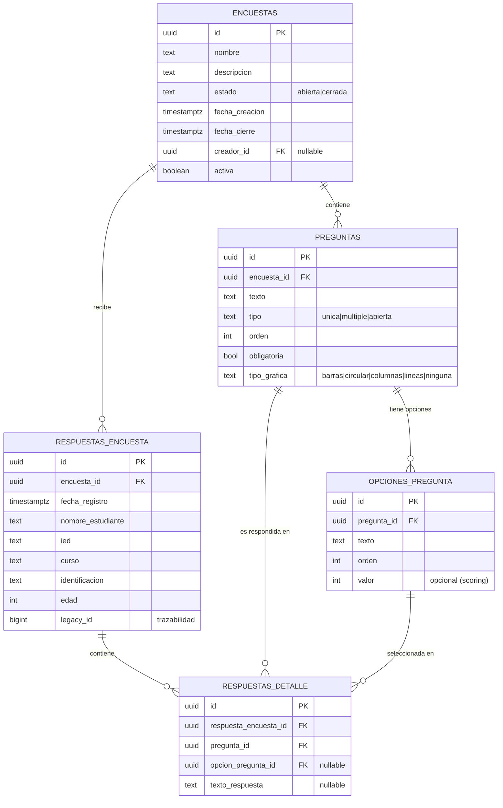

# Módulo de encuestas dinámicas

Sistema multi-encuesta con preguntas heterogéneas (única, múltiple, abierta),
cierre automático, estadísticas configurables por pregunta e import/export
Excel.  Convive con la pantalla legacy de la "Encuesta Socio-Ocupacional",
que queda en modo lectura / edición (el botón **Nueva encuesta** fue
deshabilitado a propósito).

---

## Índice

- [Diagrama ER](#diagrama-er)
- [Aplicación: rutas](#aplicación-rutas)
- [Instalación](#instalación)
- [Migraciones](#migraciones)
- [Cierre automático de encuestas](#cierre-automático-de-encuestas)
- [RLS y autenticación](#rls-y-autenticación)
- [Servicios y payloads de ejemplo](#servicios-y-payloads-de-ejemplo)
- [Import / Export Excel](#import--export-excel)
- [Tests](#tests)

---

## Diagrama ER



**Regla de integridad** (`respuestas_detalle`): cada detalle tiene
*o* una `opcion_pregunta_id` (preguntas cerradas) *o* un `texto_respuesta`
(respuesta abierta), nunca ambos ni ninguno.  Garantizado por la
constraint `chk_respuesta_exclusiva` y el trigger
`validar_respuesta_detalle()` (valida coherencia tipo pregunta ↔ tipo
respuesta).

---

## Aplicación: rutas

| Ruta                              | Página                        | Descripción                                   |
| --------------------------------- | ----------------------------- | --------------------------------------------- |
| `/`                               | `LegacyEncuestaPage`          | Encuesta Socio-Ocupacional (legacy).          |
| `/admin`                          | `AdminEncuestasPage`          | Listado y CRUD de encuestas dinámicas.        |
| `/admin/encuestas/nueva`          | `EncuestaBuilderPage`         | Crear encuesta.                               |
| `/admin/encuestas/:id`            | `EncuestaBuilderPage`         | Editar encuesta (preguntas, opciones, orden). |
| `/estadisticas/:id`               | `EstadisticasEncuestaPage`    | Dashboard + import/export Excel.              |
| `/responder`                      | `SeleccionarEncuestaPage`     | Selector de encuestas abiertas.               |
| `/responder/:id`                  | `ResponderEncuestaPage`       | Formulario dinámico por encuesta.             |

---

## Instalación

```bash
npm install
cp .env.example .env  # y configurar VITE_SUPABASE_URL / VITE_SUPABASE_ANON_KEY
npm run dev           # http://localhost:5173
npm test              # corre vitest
npm run build         # bundle de producción
```

---

## Migraciones

Ubicadas en `supabase/migrations/`:

1. `20260418000100_encuestas_dinamicas.sql` — esquema, triggers, RLS y
   función `cerrar_encuestas_vencidas()`.
2. `20260418000200_migracion_encuesta_legacy.sql` — **migración de
   datos** de la tabla `encuestas_orientacion` al nuevo modelo.  Crea la
   encuesta preexistente con UUID fijo
   `11111111-1111-1111-1111-111111111111`, sus preguntas/opciones y
   copia cada fila legacy a `respuestas_encuesta` + `respuestas_detalle`
   (idempotente gracias a la columna `legacy_id`).

Ambas son idempotentes: se pueden correr varias veces sin duplicar
datos.  Para ejecutarlas en Supabase:

```bash
# Con la CLI:
supabase db push
# o pegarlas en el editor SQL del dashboard, en orden.
```

---

## Cierre automático de encuestas

Hay dos mecanismos redundantes:

1. **Trigger** `validar_encuesta_abierta` (reactivo): al insertar una
   respuesta, si la encuesta está cerrada o si `fecha_cierre <= NOW()`,
   la cierra y rechaza la inserción.
2. **Job programado** (proactivo): la función
   `public.cerrar_encuestas_vencidas()` cierra todas las encuestas
   vencidas.  Agenda con `pg_cron`:

```sql
-- Una vez por hora
SELECT cron.schedule(
  'cerrar-encuestas-vencidas',
  '0 * * * *',
  $$ SELECT public.cerrar_encuestas_vencidas(); $$
);
```

Alternativamente puede invocarse desde una Edge Function programada.

---

## RLS y autenticación

El proyecto aún **no tiene login**; las políticas actuales son
permisivas (siguen el patrón del módulo legacy).  Cuando se habilite
Supabase Auth basta con reemplazar las policies `*_open` por las
plantillas comentadas al final de la migración `0001`:

```sql
-- Lectura pública sólo de encuestas abiertas
CREATE POLICY encuestas_lectura_publica ON public.encuestas FOR SELECT
  USING (estado = 'abierta' AND activa = TRUE);

-- El creador administra sus encuestas
CREATE POLICY encuestas_admin_all ON public.encuestas FOR ALL
  USING (auth.uid() = creador_id) WITH CHECK (auth.uid() = creador_id);
```

El campo `encuestas.creador_id` es nullable precisamente para soportar
esta etapa previa a la auth.

---

## Servicios y payloads de ejemplo

### Crear encuesta

```js
import { crearEncuesta } from '@/services/encuestasService'

await crearEncuesta({
  nombre: 'Satisfacción 2026',
  descripcion: 'Encuesta de satisfacción trimestral',
  fecha_cierre: '2026-06-30T23:59:00-05:00',
})
```

### Guardar preguntas (reemplazo completo)

```js
import { reemplazarPreguntas } from '@/services/preguntasService'

await reemplazarPreguntas(encuestaId, [
  {
    texto: '¿Qué carrera te gustaría estudiar?',
    tipo: 'unica_respuesta',
    orden: 1,
    obligatoria: true,
    tipo_grafica: 'circular',
    opciones: [
      { texto: 'Ingeniería', orden: 1 },
      { texto: 'Medicina',   orden: 2 },
    ],
  },
  {
    texto: '¿En qué áreas te destacas? (múltiple)',
    tipo: 'multiple_respuesta',
    orden: 2,
    obligatoria: false,
    tipo_grafica: 'barras',
    opciones: [
      { texto: 'Matemáticas', orden: 1 },
      { texto: 'Lenguaje',    orden: 2 },
      { texto: 'Deportes',    orden: 3 },
    ],
  },
  {
    texto: 'Comentarios adicionales',
    tipo: 'respuesta_abierta',
    orden: 3,
    obligatoria: false,
    tipo_grafica: 'ninguna',
  },
])
```

### Guardar una respuesta

```js
import { guardarRespuestaEncuesta } from '@/services/respuestasService'

await guardarRespuestaEncuesta({
  encuesta_id: encuestaId,
  estudiante: {
    nombre_estudiante: 'Ana Pérez',
    ied: 'IED Buena Esperanza',
    curso: '11-A',
    identificacion: '1234567890',
    edad: 17,
  },
  respuestas: {
    // por tipo de pregunta:
    'uuid-preg-1': 'uuid-opc-1',                       // unica_respuesta
    'uuid-preg-2': ['uuid-opc-a', 'uuid-opc-c'],       // multiple_respuesta
    'uuid-preg-3': 'Todo me pareció muy útil.',        // respuesta_abierta
  },
  preguntas: encuesta.preguntas, // metadata para saber tipo
})
```

---

## Import / Export Excel

Los utilitarios viven en `src/utils/`:

- `exportEncuestaNuevaExcel.js`
  - `exportarEncuestaExcel(encuestaId, nombre)` — descarga `.xlsx` con
    formato **ancho** (una fila por respuesta, una columna por
    pregunta).  Incluye una hoja `Preguntas` con la metadata.
  - `descargarPlantillaImportacion(encuestaId, nombre)` — genera una
    plantilla vacía con fila de ayuda que explica cada columna.
- `importEncuestaNuevaExcel.js`
  - `importarEncuestaExcel(file, encuestaId)` — valida cabeceras,
    mapea cada opción por texto (case-insensitive) y crea una
    respuesta por fila.  Devuelve `{ ok, fallos: [{fila,error}], total }`.

Formato de columnas:

| Fecha registro (opcional) | Nombre | IED | Curso | Identificación | Edad | P1. ¿...? | P2. ¿...? | ... |
| ------------------------- | ------ | --- | ----- | -------------- | ---- | --------- | --------- | --- |

Para preguntas `multiple_respuesta`, separar valores por coma:
`Ingeniería, Medicina`.

---

## Tests

```bash
npm test            # vitest run
npm run test:watch  # modo watch
```

Cobertura actual (unitarios, puros):

- `src/services/preguntasService.test.js` — validación de preguntas.
- `src/services/respuestasService.test.js` — validación de cabecera y
  respuestas según tipo de pregunta.
- `src/utils/estadisticasEncuesta.test.js` — agregación por pregunta y
  frecuencia de palabras con stop-words en español.

Los tests puros permiten testear sin red.  Los servicios que hablan con
Supabase se cubren indirectamente (las funciones puras de validación
son la capa más frágil).

---

## Criterios de aceptación (checklist)

- [x] Se pueden crear encuestas con los 3 tipos de pregunta y opciones
  configurables.
- [x] El trigger `validar_encuesta_abierta` impide registrar respuestas
  en encuestas cerradas o vencidas.
- [x] Datos del estudiante obligatorios (NOT NULL + validación
  frontend).
- [x] La encuesta legacy se migra, conserva sus respuestas y aparece en
  el listado.
- [x] El botón "Nueva Encuesta" de la pantalla legacy está
  deshabilitado (con aviso que redirige a `/admin`).
- [x] Exportar a Excel genera archivo válido y la plantilla documenta
  el formato esperado para importar.
- [x] Importar valida cabeceras y opciones; rechaza archivos mal
  formados.
- [x] Dashboard respeta el `tipo_grafica` configurado por pregunta.
- [ ] RLS estricta con roles — pendiente de habilitación de Auth.
